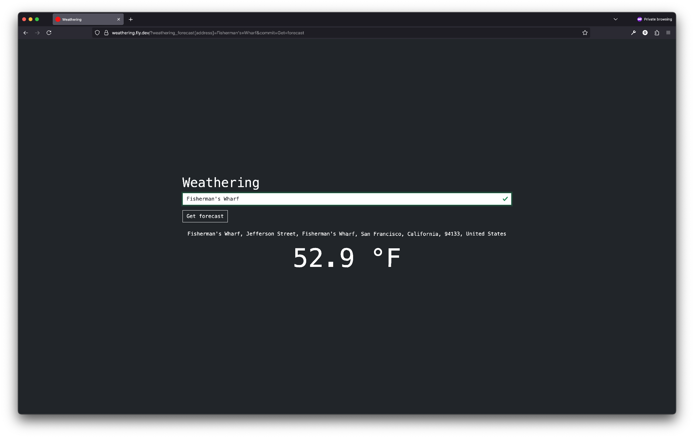
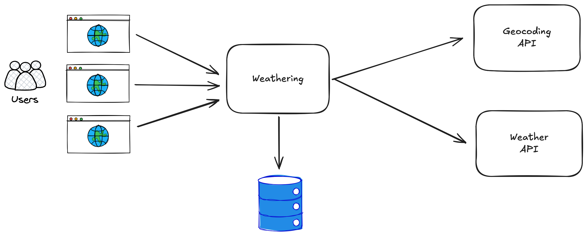

# Weathering

Weathering is a simple weather forecast app. Type in an address, or part of one, and Weathering will show you the current temperature.

See the app at [https://weathering.fly.dev](https://weathering.fly.dev).

## Architecture

Currently Weathering uses a simple single-node architecture. It relies on
caching to avoid overloading the downstream APIs. If throughput or latency
demands increase, it could be scaled horizontally to multiple servers with a
load balancer. Static assets could be served with a server like nginx to reduce
load on the Rails app.  If the PostgreSQL-based caching becomes a bottleneck,
then caching could be migrated to an in-memory cluster like Redis.

## Getting started

A [Devbox](https://www.jetify.com/docs/devbox/) configuration is provided for
convenient onboarding. Devbox handles system dependencies for this project,
including Ruby and Node.js versions as well as PostgreSQL and bundler.

If not using Devbox, the system dependencies found in
[devbox.json](./devbox.json) can be installed using the package manager of your
choice.

To get started using Devbox:
1. [Install](https://www.jetify.com/docs/devbox/installing_devbox/) Devbox.
1. Enter the Devbox shell: `devbox shell`. All system dependencies should now be installed.
1. (If using the Devbox-supplied PostgreSQL) Initialize the PostgreSQL database: `initdb`
1. Create the Rails Dev database: `bin/rails db:create`
1. `bundle install`
1. Start app services: `devbox services up`

You are now ready to modify source code, etc.

Other helpful commands:
1. Run unit tests: `bin/rails test`
1. Run system tests: `bin/rails test:system`

## CI/CD and deployment

The app is deployed to Fly.io. It can be deployed locally using `fly deploy`,
provided you have authenticated to the correct account.

(In a real production app, a description would follow of the various deployment
environments and deployment procedures, unless documented elsewhere. CI/CD would
also be described, including branching strategy, PR requirements, and any
conventions used by the team.)

## Limitations and assumptions

From the requirements, "zip codes" is interpreted as "postal codes."

While Weathering caches weather for a given postal code for 30 minutes, it does
not always successfully infer the postal code from the address input. This is
due to a
[limitation](https://nominatim.org/release-docs/latest/customize/Postcodes/) in
the Nominatim/OpenStreetMap geocoding backend. If it doesn't receive a postal
code from the geocoding service, then it avoids the forecast cache altogether.

For cache store, Weathering uses the Rails 8 default option of Solid Cache,
which uses a relational database (in this case, PostgreSQL). In the future,
other cache stores could be considered such as Redis or Memcached.

Due to time, the code in
[app/controllers/weathering/forecasts_controller.rb](./app/controllers/weathering/forecasts_controller.rb)
is under-designed. It could be improved with the following:
- The API calls for geocoding and weather forecast could become better
encapsulated using the [Split
Phase](https://martinfowler.com/articles/refactoring-dependencies.html#SplitPhase)
refactoring.
- The OpenMeteo API response could be parsed into the client object's
attributes. This would insulate users of the OpenMeteo client from changes in
the underlying API.
- Eventually the OpenMeteo client could be extracted into a separate gem to
maximize reusability.

Automated testing was done using an outside-in (BDD) style approach. A single
[system test case](./test/system/forecasts_test.rb) drove the bulk of
development. Additional finer-grained unit tests would be included.

